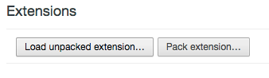

It's been a good long while since I created a blog post on here, so I figured I really had to get back to it. Today I want to go over something that I've been meaning to do for ages and when I finally sat down to do it, it took remarkably little time. I'm talking about building my own Google Chrome Extension. 

For the purpose of this blog, I'm going to talk about a simple extension to solve the problem of "I mean to click copy on that email link, but now Apple Mail is opening up :face_palm:" (this is something I *never* actually want to happen). The plan? Create an extension that would over-ride the `mailto:` and just copy the address to my clipboard instead. Going into this, my plan is to basically be able to write some sort of javascript file that will take care of the copying when I click on one of these links. 

Feel free to checkout [emailTo:Clipeboard](https://chrome.google.com/webstore/detail/dpckhpnekcojocijmcdpondmicbkbgpo)

## The key parts of a Chrome Extension

### The Manifest

I started off using Google's docs on [how to build a chrome extension](https://developer.chrome.com/extensions/getstarted). 

The absolute minimum thing you need to create a Chrome Extension is a [`manifest.json`](https://developer.chrome.com/extensions/manifest) file that has a format that looks like this:

```json
{
  "manifest_version": 2,
  "name": "eMailTo:Clipboard",
  "version": "1.0"
}
```

All we *need* to have is the version of the manifest, the name of your extension, and the version of your extension. Great! We have the bare minimum :)

As I mentioned above, I'd like to run some javascript on every page that that will over-ride the default `mailto:` action. Going through the docs on the [manifest](https://developer.chrome.com/extensions/manifest) and looking at other [chrome extensions](https://github.com/NStephenson/LE3/), I found that I needed to use the [`"content_scripts":`](https://developer.chrome.com/extensions/content_scripts) key in the manifest to run scripts. The bare minimum for this is to have an array of objects that have `"matches": []` (an array of URLs that we would like our JS to be run on) and `"js": []` (an array of js files that you'd like run).

I think I can fit all the javascript required for this into one file that I'll call `index.js`. I want this to run on _all_ webpages (seriously, I never want any mail app to open when I click on an email address), so my manifest now looks like this:

```json
{
  "manifest_version": 2,
  "name": "eMailTo:Clipboard",
  "version": "1.3",
  
  "content_scripts": [
      {
      "matches": [
          "http://*/*",
          "https://*/*"
          ],
      "js": ["index.js"]
      }
  ]
}
```

I do want to add one more optional key to the `"content_scripts"`, and that's `"run_at": <option>`. Here I want to make sure that my javascript doesn't load until the [DOM](https://developer.mozilla.org/en-US/docs/Web/API/Document_Object_Model/Introduction) is on the page. To do this, I add `"run_at": "document_idle"`. You can get a full list of options on the page linked above about content_scripts. 

The final bit that I want to add is mostly cosmetic; it's the icon at the top of the browser and what happens when it's clicked! There are two options to set this up, [`"browser_action"`](https://developer.chrome.com/extensions/browserAction) and [`"page_action"`](https://developer.chrome.com/extensions/pageAction). A page action is usually used for an extension that is only active on _some_ pages. Given that what I want to build here should be active on all pages, I'm going with `"browser_action"`. 

There are two keys that I need to build this, the icon, and the popup that displays when some one clicks on my icon:

```json
"browser_action": {
  "default_icon": "email-to-clipboard-logo.png",
  "default_popup": "popup.html"
}
```

Simply create a logo and add the path to it at `"default_icon"` and create a simple HTML page to show and input the path for that at `"default_popup"` and you'll be all set!

With everything all said and done, this is what my `manifest.json` looks like in the end:

```json
{
  "manifest_version": 2,

  "name": "eMailTo:Clipboard",
  "description": "This extension overides the html mailto: default and copys the email to your clipboard instead.",
  "version": "1.3",

  "browser_action": {
    "default_icon": "email-to-clipboard-logo.png",
    "default_popup": "popup.html"
  },
  
  "content_scripts": [
      {
      "matches": [
          "http://*/*",
          "https://*/*"
          ],
      "js": ["index.js"],
      "run_at" : "document_idle"
      }
  ]
}
```

### File Structure

I don't want to spend too much time in this post going over the specific javascript, but I'll go over the file structure and how I generally laid it all out. 

```
├──email-to-clipboard-logo.png
├──index.js
├──manifest.json
├──popup.html
```

This is generally what the [`index.js`](https://github.com/aturkewi/mailto-overide/blob/master/index.js) (check out the link for the full and current version) file looks like:

```javascript
function copyTextToClipboard(text) {
  // some cool code that allows you to pass in text and copy text to clipboard
  // shoutout to http://stackoverflow.com/a/30810322 for the copy code below
}

const listenForMailtos = () => {
  // attach listener to <body> and copy text for any clicks on `mailto:` links
}

listenForMailtos();
```

And I'm just using the HTML popup to direct people to the repo:

```html
<!doctype html>
<html>
  <head>
    <title>eMailto:Clipboard</title>
  </head>
  <body>
    <div>
      Checkout the repo at <a href='https://github.com/aturkewi/mailto-overide'>https://github.com/aturkewi/mailto-overide</a>
    </div>
  </body>
</html>
```

I was able to verify that everything was working properly by opening Chrome and then going to my extensions. From here, I clicked on the "Load unpacked extension..." button and selected the directory where I was saving all of these files. 



When you try and load your extension, you'll get any errors that are thrown from your manifest. If there are no errors thrown, you'll see your icon show up in the browser and you can start test driving it on some web pages!

Once you've finished all the tweaking, you're ready to publish this extension to the [Chrome Web Store](https://chrome.google.com/webstore/category/extensions) :)

### Uploading and Publishing!

To publish your extension, you'll need to create a zip file. The way I decided to do this was to create another directory in my file structure called `releases` where I can store the different versions of my zips :)

There are many ways to zip up your extension, but I'm just going to go over the option I went with. 

>Note: This will work on Mac (and maybe Linux?), but probably will not work on Windows. 

Type in `zip releases/emailto-clipboard-v1.0.zip email-to-clipboard-logo.png index.js manifest.json popup.html`. This will create a zip file for you with everything you need. Check out this [StackExchange article](http://unix.stackexchange.com/a/6599) for more on the zip command. If you are unable to use this command or do not like this process, you can also use Chrome's built in "Pack extension..." button (conveniently located right next to the previously mentioned "Load unpacked extension..." button).

Finally, head on over to the [Chrome Web Store Developer Dashboard](https://chrome.google.com/webstore/developer/dashboard) and upload your extension!

You now know everything you'll need to know to get your first extension published to the store! Please feel free to take a look at the repo for [eMailto:Clipboard](https://github.com/aturkewi/mailto-overide) if you'd like to see how my repo is working right now and let me know if you have any comment or questions below!